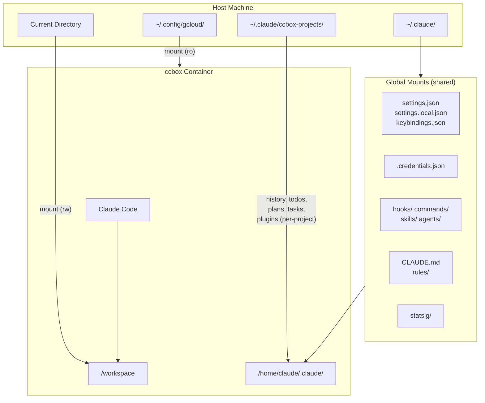

# ccbox

An opinionated, containerized Claude Code environment for Fedora.

[](https://github.com/guimou/ccbox/actions/workflows/build-and-push.yml)

## What is ccbox?

ccbox is my personal take on running [Claude Code](https://claude.com/product/claude-code) inside a container. It provides:

- **Isolation** - Each project gets its own history, todos, and session data
- **Multi-session** - Run multiple Claude Code sessions simultaneously in the same project
- **Consistency** - Same Fedora-based environment everywhere, with common dev tools pre-installed
- **Multi-platform** - Supports both x86_64/amd64 and ARM64 (Apple Silicon)
- **Rootless Podman** - Runs without root privileges using user namespaces
- **SELinux support** - Works out of the box on Fedora with proper volume labeling

## Installation

### Prerequisites

- [Podman](https://podman.io/docs/installation) installed and configured for rootless operation
- Fedora Linux (or compatible distribution) or macOS with [Podman Desktop](https://podman-desktop.io/downloads)

### Option 1: Clone the repository

```bash
git clone https://github.com/guimou/ccbox.git
cp ccbox/ccbox ~/.local/bin/
```

### Option 2: Download the script directly

```bash
curl -fsSL https://raw.githubusercontent.com/guimou/ccbox/main/ccbox -o ~/.local/bin/ccbox
chmod +x ~/.local/bin/ccbox
```

Make sure `~/.local/bin` is in your PATH.

### Installation Help

Run `ccbox --install` to get OS and shell-specific installation instructions:

```bash
./ccbox --install  # Shows symlink-based installation instructions
```

## Usage

```bash
# Run Claude Code in the current directory
ccbox

# Use a specific Claude Code version (if a container build exists for this version)
ccbox --claude-version 2.1.29

# Pass arguments directly to Claude Code
ccbox -- --help
ccbox -- --version

# Run with network firewall (restricts outbound connections, Linux only)
ccbox --with-firewall

# Build a local image (for development or Apple Silicon)
ccbox --build

# Use locally-built image
ccbox --local

# Disable clipboard access (for extra security)
ccbox --no-clipboard

# List active sessions for the current project
ccbox --list-sessions
```

You can run multiple sessions simultaneously in the same project directory. Each session gets a unique container, while sharing project data (history, todos, plans, tasks).

The container image is automatically pulled from `quay.io/guimou/ccbox` on first run.

## Configuration

### Vertex AI

To use Claude via Google Cloud Vertex AI:

```bash
export CLAUDE_CODE_USE_VERTEX=1
export ANTHROPIC_VERTEX_PROJECT_ID="your-project-id"
ccbox
```

Your gcloud credentials (`~/.config/gcloud`) are mounted read-only.

### Pin a version (for teams)

Create a `CLAUDE_VERSION` file in the ccbox directory:

```bash
echo "2.1.29" > ~/path/to/ccbox/CLAUDE_VERSION
```

This ensures everyone uses the same version. The `--claude-version` flag overrides this file.

## Architecture



## Where Data Lives

| Location | Purpose | Scope |
|----------|---------|-------|
| **Settings** | | |
| `~/.claude/settings.json` | Global settings | Shared |
| `~/.claude/settings.local.json` | Local settings (not synced) | Shared |
| `~/.claude/keybindings.json` | Keyboard shortcuts | Shared |
| **Authentication** | | |
| `~/.claude/.credentials.json` | API credentials | Shared |
| `~/.claude.json` | Claude config | Shared |
| **Extensions** | | |
| `~/.claude/hooks/` | Custom hooks | Shared |
| `~/.claude/commands/` | Global slash commands | Shared |
| `~/.claude/skills/` | Global skills | Shared |
| `~/.claude/agents/` | Global subagents | Shared |
| **Memory & Rules** | | |
| `~/.claude/CLAUDE.md` | Global memory/instructions | Shared |
| `~/.claude/rules/` | Global rules | Shared |
| **Project Data** | | |
| `~/.claude/ccbox-projects/{name}_{hash}/` | History, todos, plans, tasks, plugins | Per-project |

Each project directory gets isolated session data based on a hash of the workspace path, so you can have multiple projects with the same name in different locations. Multiple concurrent sessions in the same project share this data.

## Platform Notes

### Linux (x86_64)

The container image is pulled from `quay.io/guimou/ccbox`. This is the primary supported platform with full feature support including:
- SELinux volume labeling
- Firewall restrictions (`--with-firewall`)
- Clipboard access via Wayland or X11
- PulseAudio for audio support

### macOS (Apple Silicon)

On macOS, you should build a local ARM64 image to avoid x86 emulation:

```bash
ccbox --build          # Build native ARM64 image
ccbox                  # Auto-detects and uses local image
```

**Differences from Linux:**
- Firewall feature is not supported (requires Linux iptables)
- Clipboard access requires XQuartz for X11 support
- SELinux labels are automatically omitted (not needed with virtiofs)
- Podman machine must be running (`podman machine start`)

**Memory requirements:** Allocate at least 6GB RAM to the Podman VM for comfortable operation.

## Clipboard Support

Image pasting (CTRL+V) requires display server access:

- **Linux/Wayland**: Automatically detected via `$WAYLAND_DISPLAY`
- **Linux/X11**: Automatically detected via `$DISPLAY` and `/tmp/.X11-unix`
- **macOS**: Requires [XQuartz](https://www.xquartz.org/) with "Allow connections from network clients" enabled

To disable clipboard access: `ccbox --no-clipboard`

**Note:** Clipboard image pasting in containers has known limitations. If CTRL+V doesn't work, use file paths instead (e.g., paste `/path/to/image.png`).

## Firewall

<details>
<summary>Network restriction details (Linux only)</summary>

When launched with `--with-firewall`, outbound connections are restricted to:

- Anthropic APIs (`api.anthropic.com`, `statsig.anthropic.com`)
- GitHub (`github.com`, `api.github.com`, plus their IP ranges)
- npm registry (`registry.npmjs.org`)
- Sentry (`sentry.io`)

The firewall uses iptables/ipset and requires `NET_ADMIN` and `NET_RAW` capabilities (added automatically).

To add allowed domains, clone the repo and edit `firewall-domains.txt`, then use `--local` mode:

```bash
echo "example.com" >> firewall-domains.txt
./ccbox --build
./ccbox --local --with-firewall
```

</details>

## Development

### Building Locally

```bash
# Build with latest Claude Code version
ccbox --build

# Build with specific version
ccbox --build --claude-version 2.1.29

# Use the local image
ccbox --local
```

### Debug Mode

Set `DEBUG=1` to print the full podman command before execution:

```bash
DEBUG=1 ccbox
```

### Memory Requirements

- **Linux**: 4GB RAM minimum
- **macOS Podman VM**: 6GB RAM recommended (configure in Podman Desktop settings)

See [CONTRIBUTING.md](CONTRIBUTING.md) for:

- Adding OS packages
- CI/CD setup and Quay.io configuration

## License

[Apache License 2.0](LICENSE.md)
