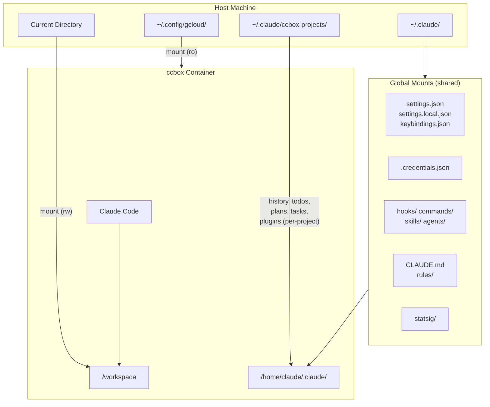

# ccbox

An opinionated, containerized Claude Code environment for Fedora.

[](https://github.com/guimou/ccbox/actions/workflows/build-and-push.yml)

## What is ccbox?

ccbox is my personal take on running [Claude Code](https://claude.com/product/claude-code) inside a container. It provides:

- **Isolation** - Each project gets its own history, todos, and session data
- **Multi-session** - Run multiple Claude Code sessions simultaneously in the same project
- **Consistency** - Same Fedora-based environment everywhere, with common dev tools pre-installed
- **Rootless Podman** - Runs without root privileges using user namespaces
- **SELinux support** - Works out of the box on Fedora with proper volume labeling
- **Multi-platform** - Supports both x86_64/amd64 and ARM64 (Apple Silicon)

## Installation

### Prerequisites

- [Podman](https://podman.io/docs/installation) installed and configured for rootless operation
- Fedora Linux (or compatible distribution) or macOS with Podman Desktop

### Option 1: Clone the repository

```bash
git clone https://github.com/guimou/ccbox.git
cd ccbox
```

To get installation instructions tailored to your OS and shell:

```bash
./ccbox --install
```

This will show you the exact commands to create a symlink and add it to your PATH.

### Option 2: Manual installation

```bash
git clone https://github.com/guimou/ccbox.git
mkdir -p ~/.local/bin
ln -sf "$(pwd)/ccbox/ccbox" ~/.local/bin/ccbox
```

Make sure `~/.local/bin` is in your PATH. Add this to your shell config if needed:

```bash
# For zsh (macOS default, some Linux)
echo 'export PATH="$HOME/.local/bin:$PATH"' >> ~/.zshrc
source ~/.zshrc

# For bash (most Linux)
echo 'export PATH="$HOME/.local/bin:$PATH"' >> ~/.bashrc
source ~/.bashrc
```

## Usage

```bash
# Run Claude Code in the current directory
ccbox

# Use a specific Claude Code version
ccbox --claude-version 2.1.29

# Build the image locally (recommended for Apple Silicon/ARM64)
ccbox --build

# Run with locally-built image
ccbox --local

# Pass arguments directly to Claude Code
ccbox -- --help
ccbox -- --version

# Run with network firewall (restricts outbound connections)
ccbox --with-firewall

# Disable clipboard access (for extra security)
ccbox --no-clipboard

# List active sessions for the current project
ccbox --list-sessions
```

You can run multiple sessions simultaneously in the same project directory. Each session gets a unique container, while sharing project data (history, todos, plans, tasks).

### Platform Notes

**macOS/Apple Silicon**: The script automatically detects ARM64 and prefers locally-built images to avoid emulation issues. On first run:

```bash
ccbox --build  # Build native ARM64 image (may take 5-10 minutes)
ccbox          # Runs with local image automatically
```

**Linux (x86_64)**: The container image is automatically pulled from `quay.io/guimou/ccbox` on first run.

## Configuration

### Vertex AI

To use Claude via Google Cloud Vertex AI:

```bash
export CLAUDE_CODE_USE_VERTEX=1
export ANTHROPIC_VERTEX_PROJECT_ID="your-project-id"
ccbox
```

Your gcloud credentials (`~/.config/gcloud`) are mounted read-only.

### Pin a version (for teams)

Create a `CLAUDE_VERSION` file in the ccbox directory:

```bash
echo "2.1.29" > ~/path/to/ccbox/CLAUDE_VERSION
```

This ensures everyone uses the same version. The `--claude-version` flag overrides this file.

### Clipboard Support

Image pasting (CTRL+V) is enabled by default. The container mounts display sockets to access the host clipboard:

- **Wayland**: Mounts `$XDG_RUNTIME_DIR/$WAYLAND_DISPLAY` (read-only)
- **X11**: Mounts `/tmp/.X11-unix` and `~/.Xauthority` (read-only)

To disable clipboard access:

```bash
ccbox --no-clipboard
```

**Note**: Clipboard image pasting in containers has known limitations. If CTRL+V doesn't work, use file paths instead (e.g., paste `/path/to/image.png`).

## Architecture



## Where Data Lives

| Location | Purpose | Scope |
|----------|---------|-------|
| **Settings** | | |
| `~/.claude/settings.json` | Global settings | Shared |
| `~/.claude/settings.local.json` | Local settings (not synced) | Shared |
| `~/.claude/keybindings.json` | Keyboard shortcuts | Shared |
| **Authentication** | | |
| `~/.claude/.credentials.json` | API credentials | Shared |
| `~/.claude.json` | Claude config | Shared |
| **Extensions** | | |
| `~/.claude/hooks/` | Custom hooks | Shared |
| `~/.claude/commands/` | Global slash commands | Shared |
| `~/.claude/skills/` | Global skills | Shared |
| `~/.claude/agents/` | Global subagents | Shared |
| **Memory & Rules** | | |
| `~/.claude/CLAUDE.md` | Global memory/instructions | Shared |
| `~/.claude/rules/` | Global rules | Shared |
| **Project Data** | | |
| `~/.claude/ccbox-projects/{name}_{hash}/` | History, todos, plans, tasks, plugins | Per-project |

Each project directory gets isolated session data based on a hash of the workspace path, so you can have multiple projects with the same name in different locations. Multiple concurrent sessions in the same project share this data.

## Firewall

<details>
<summary>Network restriction details</summary>

When launched with `--with-firewall`, outbound connections are restricted to:

- Anthropic APIs (`api.anthropic.com`, `statsig.anthropic.com`)
- GitHub (`github.com`, `api.github.com`, plus their IP ranges)
- npm registry (`registry.npmjs.org`)
- Sentry (`sentry.io`)

The firewall uses iptables/ipset and requires `NET_ADMIN` and `NET_RAW` capabilities (added automatically).

To add allowed domains, clone the repo and edit `firewall-domains.txt`, then use `--local` mode:

```bash
echo "example.com" >> firewall-domains.txt
./ccbox --build
./ccbox --local --with-firewall
```

</details>

## Development

### Building Locally

For local development or customization:

```bash
# Build with default version
./ccbox --build

# Build with specific Claude Code version
./ccbox --build --claude-version 2.1.29
```

### Adding OS Packages

Edit `os-packages.txt` (one package per line) and rebuild:

```bash
echo "package-name" >> os-packages.txt
./ccbox --build
```

### Memory Requirements

Building the image requires sufficient memory:
- **Linux**: Ensure your system has at least 4GB free RAM
- **macOS**: Increase Podman VM memory if builds fail with OOM errors:

```bash
podman machine stop
podman machine set --memory 6144  # 6GB
podman machine start
```

See [CONTRIBUTING.md](CONTRIBUTING.md) for more details on CI/CD and publishing.

## License

[Apache License 2.0](LICENSE.md)
